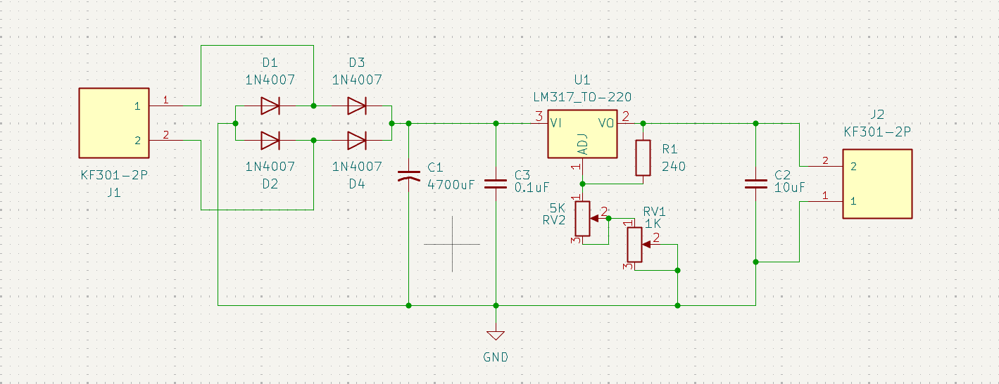

```
                    *                    
                   ***                  
                  *****                 
                 *******                
                ** *** **               
               **   *   **        *     
              **         **      ***    
             **           **    *****   
            **             **  ** * **  
           **               ****   ****  
          **_________________**______**_ 
        ═══════════════════════════════════
                  A  L  P  S              
          Adjustable Lab Power Supply     
        ═══════════════════════════════════
```

# Adjustable Lab Power Supply - 12V 1A

## Approach and Objective of the Project

This is a simple design for a 12V 1A power supply, used more as a project to learn how to use KiCad, learn PCB design rules and make full documentation of every choice and all the theoretical values and calculations for this specific design. I decided to make this project just because it was the first circuit I ever made when I got into electronics in school. For the calculations I use 5 decimals just to make it more "precise". In this project I use 12V because I thought it's the minimum recommended for testing electronics and you can find cheaper transformers for this voltage. This also comes with some complications for the design and calculations in the "Worst Case Scenario". My personal recommendation is to get a 24V transformer for more margin in border situations, like when you connect a load that consumes the full 1A from the power supply.

The whole idea behind the documentation is something I always felt was missing when I was learning. A lot of projects just say "12V 1A power supply" and show you a schematic, but they never explain how they got there, if those 12V at 1A are real, or how much ripple that DC signal actually has. So here I try to write down every calculation and every decision, even the ones that show the limitations of the design. I find it genuinely useful when documentation goes beyond the final result, so I try to write my own projects that way.

## Schematic Design and Calculations

In this circuit I start by calculating the theoretical maximum voltage after the rectifying phase for this specific transformer (12Vrms). The maximum voltage, or peak voltage, should be:

```math
12 \cdot\sqrt{2}=16.97056[V]
```

We must consider that we are using a full bridge rectifier, so in each cycle of the sinusoidal wave the alternating current passes through 2 diodes. I will use the worst case scenario from the 1N4007 NXP Semiconductors datasheet, where the forward voltage is 1.1V at 25°C. Due to the fabrication process, diodes have a negative temperature coefficient, so at higher temperatures this voltage will be lower. Assuming the 25°C situation, we are losing 2.2V in the rectifying phase, so the remaining voltage is:

```math
16.97056-2.2=14.77056[V]
```

For the capacitor calculation I will use the formula:

```math
V_{rr}=\frac{I}{2fC}
```

Since this is a full bridge rectifier, the frequency doubles — that is the reason I use `2f` instead of just `f`. I will use a 4700μF capacitor. The reason behind this choice is that it is the most common high-capacitance commercial value. In future versions I will leave space for 2 extra optional capacitors, just in case you are crazy enough (like me) to want the system to be as stable and precise as possible. Using 1A as `I`, 50Hz as `f`, and 4700μF as `C`, we obtain a beautiful and horrific ripple voltage of 2.12765Vr, which leaves us with:

```math
14.77056-2.12765=12.64291[V]
```

This is the main reason why I recommend using a 24V transformer instead of 12V — this phase consumes a large portion of the original AC voltage to convert it to DC. So far we have a 12.6Vdc supply, but in order to make it adjustable we need to use an LDO like the LM317. If we read the LM317 datasheet we notice that the required headroom voltage is 3V, meaning we need at least 15V at the input for a 12V output. As we can see, we do not fulfill that condition. We are close enough to call this a 12V regulator, though in the worst case you could also say that I lied to you in the title — and that would also be true. I probably should have called this a 9V 1A regulator, but 12V 1A sounds better and sells more. To be serious though: in practice, at partial load the ripple voltage decreases, meaning the input to the LM317 stays above the required headroom. Full 1A load represents the worst case scenario described above.

## Output Voltage Adjustment

Now that we have our DC voltage we need to make it adjustable, and that is where the LM317 does its job. Internally the LM317 always keeps a reference voltage of 1.25V between its output pin (VO) and the adjustment pin (ADJ). Using that reference and a resistor divider we can set the output voltage with this formula:

```math
V_{out}=1.25\cdot\left(1+\frac{R2}{R1}\right)+I_{adj}\cdot R2
```

The `Iadj` current is around 50μA, so small that almost everyone ignores it in practice, which leaves us with the simplified formula:

```math
V_{out}=1.25\cdot\left(1+\frac{R2}{R1}\right)
```

In my circuit R1 is a fixed 240Ω resistor between VO and ADJ, and R2 is the combination of two potentiometers in series between ADJ and GND, one for coarse adjustment and one for fine adjustment. The minimum output voltage happens when R2 is 0Ω:

```math
V_{out}=1.25\cdot\left(1+\frac{0}{240}\right)=1.25000[V]
```

For the maximum I provide two resistor configurations depending on the transformer you want to use:

**For a 12V transformer (practical range 1.25V - 9V):**
- RV1 = 1K (fine adjust)
- RV2 = 2K (coarse adjust)
- Total R2 = 3000Ω

```math
V_{out}=1.25\cdot\left(1+\frac{3000}{240}\right)=16.87500[V]
```

**For a 24V transformer (practical range 1.25V - 20V) — used in this schematic:**
- RV1 = 1K (fine adjust)
- RV2 = 5K (coarse adjust)
- Total R2 = 6000Ω

```math
V_{out}=1.25\cdot\left(1+\frac{6000}{240}\right)=32.50000[V]
```

In both cases the theoretical maximum is way above what we can actually reach, because the real limit is always set by the input voltage, not by the resistors. The regulator does not do magic, if you only have 12.6V at the input you are not getting 32V at the output no matter what the formula says. I used the 5K configuration in the schematic so the board is ready for a 24V transformer in future versions, but if you are building this with a 12V transformer the 2K version gives you a finer and more useful adjustment over the range you can actually use.

## Power Dissipation and Thermal Considerations

This is the part most people skip and then wonder why their LM317 shuts down or burns their finger. The LM317 is a linear regulator, which means it dissipates the voltage difference between input and output as heat. The power it has to dissipate is:

```math
P_{diss}=(V_{in}-V_{out})\cdot I
```

The worst case here is not at maximum voltage, it is at minimum output voltage with maximum current, because that is when the voltage difference is the largest. If someone sets the output to the minimum 1.25V while pulling the full 1A from a 12.6V input:

```math
P_{diss}=(12.64291-1.25)\cdot 1=11.39291[W]
```

That is a lot of heat for a small TO-220 package, basically you just built a 11W heater that also happens to regulate voltage. The LM317 in a TO-220 package without a heatsink has a thermal resistance from junction to ambient of around 50°C/W, so even at a more reasonable 3.6W (output at 9V, 1A) the junction temperature rise would be:

```math
\Delta T=3.6\cdot 50=180[°C]
```

The LM317 has internal thermal protection that shuts it down around 125-150°C, so it will not destroy itself, it will just turn off and ruin your day. The conclusion is simple: **you must use a heatsink** if you plan to use this supply at high currents or large voltage differences. With a decent heatsink the thermal resistance drops to around 5°C/W, which keeps everything under control:

```math
\Delta T=3.6\cdot 5=18[°C]
```

This is one more reason why I keep saying that a 24V transformer is a better idea only if you also size the heatsink properly, because more input voltage also means more heat to dissipate when the output is low.

## Output Stage

After the regulator I use a 10μF capacitor (C2) at the output. The LM317 datasheet recommends an output capacitor to improve transient response and stability, and 10μF is a safe and common value for this. I also keep a 0.1μF ceramic capacitor (C3) at the input of the regulator right next to it as a bypass capacitor, because the big 4700μF electrolytic is slow at high frequencies and a small ceramic covers the high frequency noise that the electrolytic cannot handle well. Mixing a big electrolytic for bulk capacitance and a small ceramic for bypass is standard practice and costs almost nothing.

## Bill of Materials (BOM)

| Reference | Component | Value | Notes |
|-----------|-----------|-------|-------|
| J1 | Screw terminal KF301-2P | - | AC input from transformer |
| J2 | Screw terminal KF301-2P | - | DC output |
| D1-D4 | Diode 1N4007 | - | Full bridge rectifier |
| C1 | Electrolytic capacitor | 4700μF | Bulk filtering |
| C3 | Ceramic capacitor | 0.1μF | Input bypass |
| C2 | Electrolytic capacitor | 10μF | Output stability |
| U1 | LDO regulator LM317 | TO-220 | Heatsink recommended |
| R1 | Resistor | 240Ω | Fixed divider resistor |
| RV1 | Potentiometer | 1K | Fine adjust |
| RV2 | Potentiometer | 5K (or 2K) | Coarse adjust |

## Images

### Schematic


### PCB Layout


### 3D Render


## Notes and Honesty Section

Just to be completely clear about what this project is and what it is not:

- The "12V 1A" in the title is the nominal target, not a guarantee at every operating point. As explained above, the real output range depends on your transformer, and with a 12V transformer the practical maximum is closer to 9V at full load.
- A heatsink is not optional if you push this supply hard. The bare TO-220 will overheat and shut down.
- This is a learning project, not a replacement for a commercial bench supply. It will not compete with a proper lab supply, but it is a great way to understand every stage of a linear regulated power supply from the ground up.

If this documentation or the design is useful for someone learning the same things I am learning, feel free to use anything here.

---
